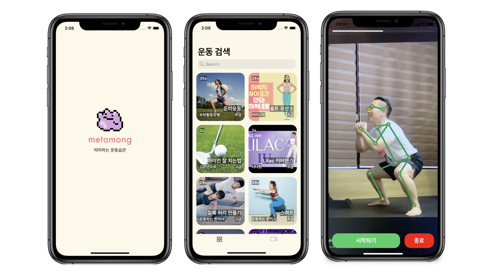

# Metamong

> 따라하는 운동습관, Metamong

## 개발 목표
COVID-19 팬데믹의 장기화로 인한 비대면 생활이 일상화됨에 장소에 국한되지 않고 집에서 운동하는 ‘홈트족’ 들 또한 크게 늘어나고 있습니다. 그에 따라 홈 트레이닝 관련 시장의 규모 또한 급격히 커지고 있는 상황입니다. 이에 발맞춰 Human Pose Estimation을 통한 포즈 분석으로 사용자에게 피드백을 제공해 올바른 운동자세의 학습과 더불어 운동하는 재미를 줄 수 있는 어플리케이션의 개발을 목표로 합니다.

## Developers
<table>
  <tr>
    <td align="center"><a href="https://github.com/Yabby1997"> <b>Seunghun Yang</b></a> <a href="https://github.com/ProjectMetamong/PoC-iOS-Application/commits?author=yabby1997" title="commits">🧑‍💻</a><a href="https://www.notion.so/yabby/Metamong-c0a9b8f83cd84e1db819d8eb18f1a549" title="notion">📕</a></td>
    <td align="center"><a href="https://github.com/colories"> <b>김정현</b></a> <a href="https://github.com/ProjectMetamong/PoC-iOS-Application/commits?author=colories" title="commits">🧑‍💻</a></td>
  </tr>
</table>

## TMI
[노션](https://www.notion.so/yabby/Metamong-c0a9b8f83cd84e1db819d8eb18f1a549)에서 개발 로그를 확인할 수 있습니다.